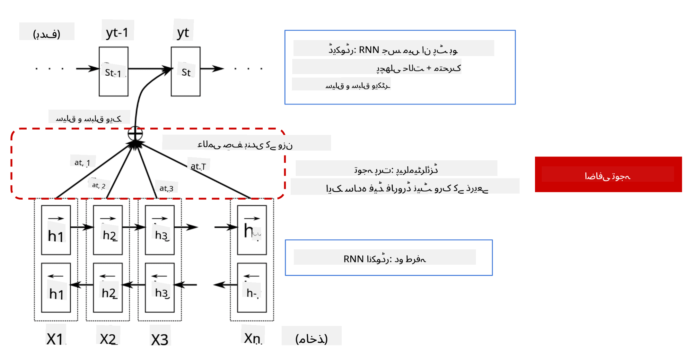
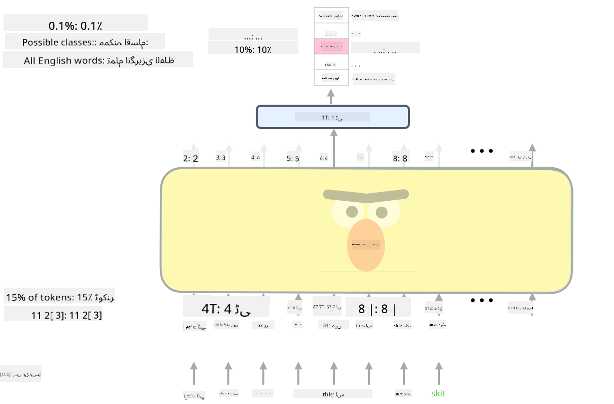

<!--
CO_OP_TRANSLATOR_METADATA:
{
  "original_hash": "7e617f0b8de85a43957a853aba09bfeb",
  "translation_date": "2025-08-26T08:34:10+00:00",
  "source_file": "lessons/5-NLP/18-Transformers/README.md",
  "language_code": "ur"
}
-->
# توجہ کے طریقہ کار اور ٹرانسفارمرز

## [لیکچر سے پہلے کا کوئز](https://red-field-0a6ddfd03.1.azurestaticapps.net/quiz/118)

NLP کے شعبے میں سب سے اہم مسائل میں سے ایک **مشین ترجمہ** ہے، جو کہ ایک بنیادی کام ہے جو گوگل ٹرانسلیٹ جیسے ٹولز کے پیچھے کام کرتا ہے۔ اس سیکشن میں، ہم مشین ترجمہ پر توجہ مرکوز کریں گے، یا عمومی طور پر، کسی بھی *سیکوئنس-ٹو-سیکوئنس* کام پر (جسے **جملے کی تبدیلی** بھی کہا جاتا ہے)۔

RNNs کے ساتھ، سیکوئنس-ٹو-سیکوئنس دو ری کرنٹ نیٹ ورکس کے ذریعے نافذ کیا جاتا ہے، جہاں ایک نیٹ ورک، **انکوڈر**، ان پٹ سیکوئنس کو ایک چھپی ہوئی حالت میں تبدیل کرتا ہے، جبکہ دوسرا نیٹ ورک، **ڈیکوڈر**، اس چھپی ہوئی حالت کو ترجمہ شدہ نتیجے میں تبدیل کرتا ہے۔ اس طریقے کے ساتھ کچھ مسائل ہیں:

* انکوڈر نیٹ ورک کی آخری حالت جملے کے آغاز کو یاد رکھنے میں مشکل محسوس کرتی ہے، جس کی وجہ سے لمبے جملوں کے لیے ماڈل کی کوالٹی خراب ہو جاتی ہے۔
* سیکوئنس کے تمام الفاظ کا نتیجے پر ایک جیسا اثر ہوتا ہے۔ حقیقت میں، تاہم، ان پٹ سیکوئنس کے مخصوص الفاظ اکثر دوسرے الفاظ کے مقابلے میں زیادہ اثر رکھتے ہیں۔

**توجہ کے طریقہ کار** RNN کے ہر آؤٹ پٹ پیش گوئی پر ہر ان پٹ ویکٹر کے سیاق و سباق کے اثر کو وزن دینے کا ایک ذریعہ فراہم کرتے ہیں۔ اس کو نافذ کرنے کا طریقہ یہ ہے کہ ان پٹ RNN کی درمیانی حالتوں اور آؤٹ پٹ RNN کے درمیان شارٹ کٹس بنائے جائیں۔ اس طرح، جب آؤٹ پٹ علامت yt پیدا کی جاتی ہے، تو ہم تمام ان پٹ چھپی ہوئی حالتوں hi کو مختلف وزن کے کوفی شینٹس αt,i کے ساتھ مدنظر رکھیں گے۔

> انکوڈر-ڈیکوڈر ماڈل اضافی توجہ کے طریقہ کار کے ساتھ [Bahdanau et al., 2015](https://arxiv.org/pdf/1409.0473.pdf)، [اس بلاگ پوسٹ](https://lilianweng.github.io/lil-log/2018/06/24/attention-attention.html) سے لیا گیا۔

توجہ میٹرکس {αi,j} اس حد کو ظاہر کرے گا کہ ان پٹ سیکوئنس کے مخصوص الفاظ آؤٹ پٹ سیکوئنس میں دیے گئے لفظ کی تخلیق میں کیا کردار ادا کرتے ہیں۔ نیچے ایک مثال دی گئی ہے:

> تصویر [Bahdanau et al., 2015](https://arxiv.org/pdf/1409.0473.pdf) (Fig.3) سے۔

توجہ کے طریقہ کار NLP میں موجودہ یا قریب موجودہ جدید ترین حالت کے لیے ذمہ دار ہیں۔ تاہم، توجہ شامل کرنے سے ماڈل کے پیرامیٹرز کی تعداد میں بہت زیادہ اضافہ ہوتا ہے، جس کی وجہ سے RNNs کے ساتھ اسکیلنگ کے مسائل پیدا ہوتے ہیں۔ RNNs کو اسکیل کرنے کی ایک اہم رکاوٹ یہ ہے کہ ماڈلز کی ری کرنٹ نوعیت تربیت کو بیچ اور متوازی بنانے میں مشکل پیدا کرتی ہے۔ RNN میں سیکوئنس کے ہر عنصر کو ترتیب وار پروسیس کرنا ضروری ہوتا ہے، جس کا مطلب ہے کہ اسے آسانی سے متوازی نہیں بنایا جا سکتا۔

> تصویر [گوگل کے بلاگ](https://research.googleblog.com/2016/09/a-neural-network-for-machine.html) سے۔

توجہ کے طریقہ کار کو اپنانے اور اس رکاوٹ کے امتزاج نے آج کے جدید ترین ٹرانسفارمر ماڈلز کی تخلیق کی راہ ہموار کی، جیسے BERT اور Open-GPT3۔

## ٹرانسفارمر ماڈلز

ٹرانسفارمرز کے پیچھے ایک اہم خیال یہ ہے کہ RNNs کی ترتیب وار نوعیت سے بچا جائے اور ایک ایسا ماڈل بنایا جائے جو تربیت کے دوران متوازی ہو سکے۔ یہ دو خیالات کو نافذ کر کے حاصل کیا جاتا ہے:

* پوزیشنل انکوڈنگ
* RNNs (یا CNNs) کے بجائے پیٹرنز کو پکڑنے کے لیے سیلف-اٹینشن میکانزم کا استعمال (اسی لیے وہ مقالہ جس نے ٹرانسفارمرز کو متعارف کرایا اسے *[توجہ ہی سب کچھ ہے](https://arxiv.org/abs/1706.03762)* کہا جاتا ہے)

### پوزیشنل انکوڈنگ/ایمبیڈنگ

پوزیشنل انکوڈنگ کا خیال درج ذیل ہے:
1. RNNs کا استعمال کرتے وقت، ٹوکنز کی نسبتی پوزیشن قدموں کی تعداد سے ظاہر ہوتی ہے، اور اس لیے اسے واضح طور پر ظاہر کرنے کی ضرورت نہیں ہوتی۔
2. تاہم، جب ہم توجہ پر سوئچ کرتے ہیں، تو ہمیں سیکوئنس کے اندر ٹوکنز کی نسبتی پوزیشنز معلوم ہونی چاہئیں۔
3. پوزیشنل انکوڈنگ حاصل کرنے کے لیے، ہم اپنے ٹوکنز کے سیکوئنس کو سیکوئنس میں ٹوکن پوزیشنز کے سیکوئنس کے ساتھ بڑھاتے ہیں (یعنی، 0,1, ... کی تعداد کا ایک سیکوئنس)۔
4. پھر ہم ٹوکن پوزیشن کو ٹوکن ایمبیڈنگ ویکٹر کے ساتھ مکس کرتے ہیں۔ پوزیشن (عدد) کو ویکٹر میں تبدیل کرنے کے لیے، ہم مختلف طریقے استعمال کر سکتے ہیں:

* ٹرین ایبل ایمبیڈنگ، ٹوکن ایمبیڈنگ کی طرح۔ یہ وہ طریقہ ہے جس پر ہم یہاں غور کرتے ہیں۔ ہم ٹوکنز اور ان کی پوزیشنز دونوں پر ایمبیڈنگ لیئرز لگاتے ہیں، جس کے نتیجے میں ایک ہی ڈائمینشنز کے ایمبیڈنگ ویکٹرز بنتے ہیں، جنہیں ہم پھر ایک ساتھ شامل کرتے ہیں۔
* فکسڈ پوزیشن انکوڈنگ فنکشن، جیسا کہ اصل مقالے میں تجویز کیا گیا ہے۔

> تصویر مصنف کی طرف سے۔

پوزیشنل ایمبیڈنگ کے ساتھ جو نتیجہ ہمیں ملتا ہے وہ اصل ٹوکن اور اس کی پوزیشن کو سیکوئنس کے اندر ایمبیڈ کرتا ہے۔

### ملٹی-ہیڈ سیلف-اٹینشن

اگلا، ہمیں اپنے سیکوئنس کے اندر کچھ پیٹرنز کو پکڑنے کی ضرورت ہے۔ ایسا کرنے کے لیے، ٹرانسفارمرز **سیلف-اٹینشن** میکانزم استعمال کرتے ہیں، جو بنیادی طور پر وہی توجہ ہے جو ان پٹ اور آؤٹ پٹ کے طور پر ایک ہی سیکوئنس پر لاگو ہوتی ہے۔ سیلف-اٹینشن کو لاگو کرنے سے ہمیں جملے کے اندر **سیاق و سباق** کو مدنظر رکھنے کی اجازت ملتی ہے، اور یہ دیکھنے کی اجازت ملتی ہے کہ کون سے الفاظ آپس میں جڑے ہوئے ہیں۔ مثال کے طور پر، یہ ہمیں یہ دیکھنے کی اجازت دیتا ہے کہ کون سے الفاظ *یہ* جیسے کورفرنسز کے ذریعے حوالہ دیے گئے ہیں، اور سیاق و سباق کو بھی مدنظر رکھتا ہے:

> تصویر [گوگل بلاگ](https://research.googleblog.com/2017/08/transformer-novel-neural-network.html) سے۔

ٹرانسفارمرز میں، ہم **ملٹی-ہیڈ اٹینشن** استعمال کرتے ہیں تاکہ نیٹ ورک کو مختلف قسم کے انحصار کو پکڑنے کی طاقت دی جا سکے، جیسے طویل مدتی بمقابلہ مختصر مدتی الفاظ کے تعلقات، کورفرنس بمقابلہ کچھ اور، وغیرہ۔

[TensorFlow نوٹ بک](../../../../../lessons/5-NLP/18-Transformers/TransformersTF.ipynb) ٹرانسفارمر لیئرز کے نفاذ پر مزید تفصیلات فراہم کرتی ہے۔

### انکوڈر-ڈیکوڈر اٹینشن

ٹرانسفارمرز میں، توجہ دو جگہوں پر استعمال ہوتی ہے:

* ان پٹ متن کے اندر پیٹرنز کو پکڑنے کے لیے سیلف-اٹینشن کا استعمال۔
* سیکوئنس ترجمہ کرنے کے لیے - یہ انکوڈر اور ڈیکوڈر کے درمیان توجہ کی تہہ ہے۔

انکوڈر-ڈیکوڈر اٹینشن RNNs میں استعمال ہونے والے توجہ کے طریقہ کار سے بہت مشابہت رکھتا ہے، جیسا کہ اس سیکشن کے آغاز میں بیان کیا گیا ہے۔ یہ متحرک خاکہ انکوڈر-ڈیکوڈر اٹینشن کے کردار کی وضاحت کرتا ہے۔

چونکہ ہر ان پٹ پوزیشن کو آزادانہ طور پر ہر آؤٹ پٹ پوزیشن پر نقشہ بنایا جاتا ہے، ٹرانسفارمرز RNNs کے مقابلے میں بہتر متوازی بنانے کی صلاحیت رکھتے ہیں، جو کہ بہت بڑے اور زیادہ اظہار کرنے والے زبان کے ماڈلز کو قابل بناتا ہے۔ ہر اٹینشن ہیڈ کو الفاظ کے درمیان مختلف تعلقات سیکھنے کے لیے استعمال کیا جا سکتا ہے، جو نیچرل لینگویج پروسیسنگ کے کاموں کو بہتر بناتا ہے۔

## BERT

**BERT** (Bidirectional Encoder Representations from Transformers) ایک بہت بڑا ملٹی لیئر ٹرانسفارمر نیٹ ورک ہے جس میں *BERT-base* کے لیے 12 لیئرز، اور *BERT-large* کے لیے 24 لیئرز ہیں۔ ماڈل کو پہلے ایک بڑے متن کے ڈیٹا کارپس (ویکیپیڈیا + کتابیں) پر غیر نگرانی شدہ تربیت (جملے میں ماسک کیے گئے الفاظ کی پیش گوئی) کا استعمال کرتے ہوئے پری ٹرین کیا جاتا ہے۔ پری ٹریننگ کے دوران ماڈل زبان کی سمجھ کے اہم سطحوں کو جذب کرتا ہے، جنہیں پھر دیگر ڈیٹا سیٹس کے ساتھ فائن ٹیوننگ کے ذریعے استعمال کیا جا سکتا ہے۔ اس عمل کو **ٹرانسفر لرننگ** کہا جاتا ہے۔

> تصویر [ماخذ](http://jalammar.github.io/illustrated-bert/)

## ✍️ مشقیں: ٹرانسفارمرز

اپنی تعلیم کو درج ذیل نوٹ بکس میں جاری رکھیں:

* [PyTorch میں ٹرانسفارمرز](../../../../../lessons/5-NLP/18-Transformers/TransformersPyTorch.ipynb)
* [TensorFlow میں ٹرانسفارمرز](../../../../../lessons/5-NLP/18-Transformers/TransformersTF.ipynb)

## نتیجہ

اس سبق میں آپ نے ٹرانسفارمرز اور توجہ کے طریقہ کار کے بارے میں سیکھا، جو NLP کے ٹول باکس میں ضروری آلات ہیں۔ ٹرانسفارمر آرکیٹیکچرز کی بہت سی مختلف حالتیں ہیں، جن میں BERT، DistilBERT، BigBird، OpenGPT3 اور مزید شامل ہیں، جنہیں فائن ٹیون کیا جا سکتا ہے۔ [HuggingFace پیکیج](https://github.com/huggingface/) PyTorch اور TensorFlow دونوں کے ساتھ ان آرکیٹیکچرز کو تربیت دینے کے لیے ایک ریپوزٹری فراہم کرتا ہے۔

## 🚀 چیلنج

## [لیکچر کے بعد کا کوئز](https://red-field-0a6ddfd03.1.azurestaticapps.net/quiz/218)

## جائزہ اور خود مطالعہ

* [بلاگ پوسٹ](https://mchromiak.github.io/articles/2017/Sep/12/Transformer-Attention-is-all-you-need/)، جو کلاسیکل [توجہ ہی سب کچھ ہے](https://arxiv.org/abs/1706.03762) مقالے پر وضاحت کرتی ہے۔
* [بلاگ پوسٹس کی ایک سیریز](https://towardsdatascience.com/transformers-explained-visually-part-1-overview-of-functionality-95a6dd460452) ٹرانسفارمرز پر، جو آرکیٹیکچر کو تفصیل سے بیان کرتی ہے۔

## [اسائنمنٹ](assignment.md)

**ڈسکلیمر**:  
یہ دستاویز AI ترجمہ سروس [Co-op Translator](https://github.com/Azure/co-op-translator) کا استعمال کرتے ہوئے ترجمہ کی گئی ہے۔ ہم درستگی کے لیے پوری کوشش کرتے ہیں، لیکن براہ کرم آگاہ رہیں کہ خودکار ترجمے میں غلطیاں یا خامیاں ہو سکتی ہیں۔ اصل دستاویز کو اس کی اصل زبان میں مستند ذریعہ سمجھا جانا چاہیے۔ اہم معلومات کے لیے، پیشہ ور انسانی ترجمہ کی سفارش کی جاتی ہے۔ اس ترجمے کے استعمال سے پیدا ہونے والی کسی بھی غلط فہمی یا غلط تشریح کے لیے ہم ذمہ دار نہیں ہیں۔