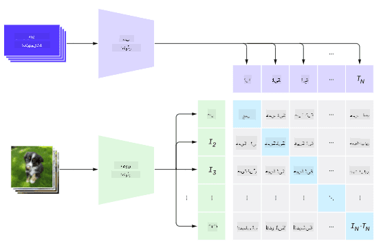
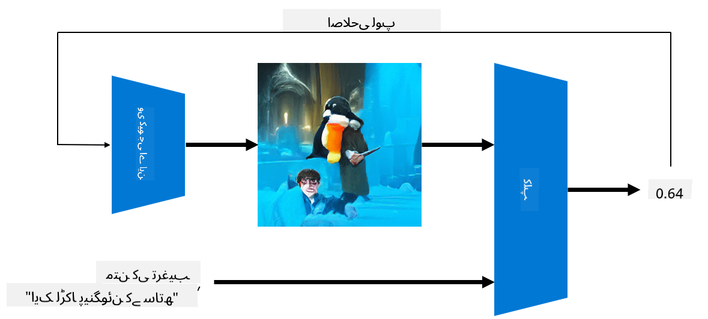

<!--
CO_OP_TRANSLATOR_METADATA:
{
  "original_hash": "9c592c26aca16ca085d268c732284187",
  "translation_date": "2025-08-26T10:17:57+00:00",
  "source_file": "lessons/X-Extras/X1-MultiModal/README.md",
  "language_code": "ur"
}
-->
# ملٹی موڈل نیٹ ورکس

ٹرانسفارمر ماڈلز کی NLP ٹاسکس میں کامیابی کے بعد، وہی یا ملتے جلتے آرکیٹیکچرز کمپیوٹر وژن ٹاسکس کے لیے بھی استعمال کیے گئے۔ اب ایسے ماڈلز بنانے میں دلچسپی بڑھ رہی ہے جو وژن اور نیچرل لینگویج کی صلاحیتوں کو *یکجا* کر سکیں۔ ان کوششوں میں سے ایک OpenAI کی جانب سے کی گئی، جسے CLIP اور DALL.E کہا جاتا ہے۔

## کانٹراسٹو امیج پری ٹریننگ (CLIP)

CLIP کا بنیادی خیال یہ ہے کہ ٹیکسٹ پرامپٹس کو کسی تصویر کے ساتھ موازنہ کیا جا سکے اور یہ معلوم کیا جا سکے کہ تصویر پرامپٹ سے کتنی مطابقت رکھتی ہے۔

> *تصویر [اس بلاگ پوسٹ](https://openai.com/blog/clip/) سے لی گئی ہے*

ماڈل انٹرنیٹ سے حاصل کردہ تصاویر اور ان کے کیپشنز پر تربیت یافتہ ہے۔ ہر بیچ کے لیے، ہم N جوڑوں (تصویر، ٹیکسٹ) کو لیتے ہیں اور انہیں کسی ویکٹر ریپریزنٹیشن میں تبدیل کرتے ہیں۔

ان ریپریزنٹیشنز کو پھر آپس میں میچ کیا جاتا ہے۔ لاس فنکشن اس طرح سے ڈیفائن کیا گیا ہے کہ ایک جوڑے (مثلاً I اور T) کے ویکٹرز کے درمیان کوسائن سمیلیریٹی کو زیادہ سے زیادہ کیا جائے، اور باقی تمام جوڑوں کے درمیان کوسائن سمیلیریٹی کو کم سے کم کیا جائے۔ یہی وجہ ہے کہ اس اپروچ کو **کانٹراسٹو** کہا جاتا ہے۔

CLIP ماڈل/لائبریری [OpenAI GitHub](https://github.com/openai/CLIP) سے دستیاب ہے۔ اس اپروچ کو [اس بلاگ پوسٹ](https://openai.com/blog/clip/) اور مزید تفصیل سے [اس پیپر](https://arxiv.org/pdf/2103.00020.pdf) میں بیان کیا گیا ہے۔

ایک بار جب یہ ماڈل پری ٹرین ہو جائے، تو ہم اسے تصاویر کے ایک بیچ اور ٹیکسٹ پرامپٹس کے ایک بیچ دے سکتے ہیں، اور یہ ایک ٹینسر کے ساتھ پروبیبلیٹیز واپس کرے گا۔ CLIP کو کئی ٹاسکس کے لیے استعمال کیا جا سکتا ہے:

**امیج کلاسیفکیشن**

فرض کریں ہمیں تصاویر کو بلیوں، کتوں اور انسانوں کے درمیان کلاسیفائی کرنا ہے۔ اس صورت میں، ہم ماڈل کو ایک تصویر اور ٹیکسٹ پرامپٹس کی ایک سیریز دیتے ہیں: "*بلی کی تصویر*", "*کتے کی تصویر*", "*انسان کی تصویر*۔" نتیجے میں ملنے والے 3 پروبیبلیٹیز کے ویکٹر میں ہمیں صرف سب سے زیادہ ویلیو والے انڈیکس کو منتخب کرنا ہوگا۔

> *تصویر [اس بلاگ پوسٹ](https://openai.com/blog/clip/) سے لی گئی ہے*

**ٹیکسٹ پر مبنی امیج سرچ**

ہم اس کے برعکس بھی کر سکتے ہیں۔ اگر ہمارے پاس تصاویر کا ایک مجموعہ ہو، تو ہم اس مجموعے کو ماڈل میں دے سکتے ہیں اور ایک ٹیکسٹ پرامپٹ - یہ ہمیں وہ تصویر دے گا جو دیے گئے پرامپٹ سے سب سے زیادہ مشابہ ہو۔

## ✍️ مثال: [CLIP کا استعمال امیج کلاسیفکیشن اور امیج سرچ کے لیے](../../../../../lessons/X-Extras/X1-MultiModal/Clip.ipynb)

[Clip.ipynb](../../../../../lessons/X-Extras/X1-MultiModal/Clip.ipynb) نوٹ بک کھولیں تاکہ CLIP کو ایکشن میں دیکھ سکیں۔

## VQGAN+CLIP کے ساتھ امیج جنریشن

CLIP کو **امیج جنریشن** کے لیے بھی استعمال کیا جا سکتا ہے، جو کہ کسی ٹیکسٹ پرامپٹ سے کی جاتی ہے۔ اس کے لیے ہمیں ایک **جنریٹر ماڈل** کی ضرورت ہوتی ہے جو کسی ویکٹر ان پٹ کی بنیاد پر تصاویر بنا سکے۔ ان میں سے ایک ماڈل [VQGAN](https://compvis.github.io/taming-transformers/) (ویکٹر-کوانٹائزڈ GAN) کہلاتا ہے۔

VQGAN کی وہ بنیادی باتیں جو اسے عام [GAN](../../4-ComputerVision/10-GANs/README.md) سے مختلف بناتی ہیں، درج ذیل ہیں:
* آٹو ریگریسیو ٹرانسفارمر آرکیٹیکچر کا استعمال، جو تصویر کے سیاق و سباق سے بھرپور حصے تیار کرتا ہے۔ یہ بصری حصے [CNN](../../4-ComputerVision/07-ConvNets/README.md) کے ذریعے سیکھے جاتے ہیں۔
* سب-امیج ڈسکریمینیٹر کا استعمال، جو یہ پتہ لگاتا ہے کہ تصویر کے حصے "حقیقی" ہیں یا "جعلی" (روایتی GAN کے "سب یا کچھ نہیں" اپروچ کے برعکس)۔

VQGAN کے بارے میں مزید جاننے کے لیے [Taming Transformers](https://compvis.github.io/taming-transformers/) ویب سائٹ دیکھیں۔

VQGAN اور روایتی GAN کے درمیان ایک اہم فرق یہ ہے کہ روایتی GAN کسی بھی ان پٹ ویکٹر سے ایک معقول تصویر بنا سکتا ہے، جبکہ VQGAN ممکنہ طور پر ایک غیر مربوط تصویر بنا سکتا ہے۔ لہذا، ہمیں امیج کریشن کے عمل کو مزید گائیڈ کرنے کی ضرورت ہوتی ہے، اور یہ CLIP کے ذریعے کیا جا سکتا ہے۔

کسی ٹیکسٹ پرامپٹ سے مطابقت رکھنے والی تصویر بنانے کے لیے، ہم کسی رینڈم انکوڈنگ ویکٹر سے شروع کرتے ہیں، جو VQGAN کے ذریعے ایک تصویر تیار کرتا ہے۔ پھر CLIP ایک لاس فنکشن تیار کرتا ہے جو یہ ظاہر کرتا ہے کہ تصویر ٹیکسٹ پرامپٹ سے کتنی مطابقت رکھتی ہے۔ اس کے بعد مقصد یہ ہوتا ہے کہ اس لاس کو کم سے کم کیا جائے، بیک پروپیگیشن کے ذریعے ان پٹ ویکٹر کے پیرامیٹرز کو ایڈجسٹ کرتے ہوئے۔

VQGAN+CLIP کو نافذ کرنے والی ایک بہترین لائبریری [Pixray](http://github.com/pixray/pixray) ہے۔

 |   | 
----|----|----
پرامپٹ سے تیار کردہ تصویر *ایک نوجوان مرد ادب کے استاد کی کتاب کے ساتھ واٹر کلر پورٹریٹ* | پرامپٹ سے تیار کردہ تصویر *ایک نوجوان خاتون کمپیوٹر سائنس کی استاد کا آئل پورٹریٹ کمپیوٹر کے ساتھ* | پرامپٹ سے تیار کردہ تصویر *ایک بوڑھے مرد ریاضی کے استاد کا آئل پورٹریٹ بلیک بورڈ کے سامنے*

> تصاویر **مصنوعی اساتذہ** کے مجموعے سے، [دمیتری سوشنیکوف](http://soshnikov.com) کی جانب سے

## DALL-E
### [DALL-E 1](https://openai.com/research/dall-e)
DALL-E GPT-3 کا ایک ورژن ہے جو پرامپٹس سے تصاویر بنانے کے لیے تربیت یافتہ ہے۔ اسے 12-بلین پیرامیٹرز کے ساتھ تربیت دی گئی ہے۔

CLIP کے برعکس، DALL-E ٹیکسٹ اور تصویر دونوں کو ایک ہی ٹوکنز کے سلسلے کے طور پر لیتا ہے۔ لہذا، مختلف پرامپٹس سے آپ ٹیکسٹ کی بنیاد پر تصاویر بنا سکتے ہیں۔

### [DALL-E 2](https://openai.com/dall-e-2)
DALL-E 1 اور 2 کے درمیان بنیادی فرق یہ ہے کہ DALL-E 2 زیادہ حقیقت پسندانہ تصاویر اور آرٹ تیار کرتا ہے۔

DALL-E کے ساتھ تصاویر کی مثالیں:
 |   | 
----|----|----
پرامپٹ سے تیار کردہ تصویر *ایک نوجوان مرد ادب کے استاد کی کتاب کے ساتھ واٹر کلر پورٹریٹ* | پرامپٹ سے تیار کردہ تصویر *ایک نوجوان خاتون کمپیوٹر سائنس کی استاد کا آئل پورٹریٹ کمپیوٹر کے ساتھ* | پرامپٹ سے تیار کردہ تصویر *ایک بوڑھے مرد ریاضی کے استاد کا آئل پورٹریٹ بلیک بورڈ کے سامنے*

## حوالہ جات

* VQGAN پیپر: [Taming Transformers for High-Resolution Image Synthesis](https://compvis.github.io/taming-transformers/paper/paper.pdf)
* CLIP پیپر: [Learning Transferable Visual Models From Natural Language Supervision](https://arxiv.org/pdf/2103.00020.pdf)

**ڈسکلیمر**:  
یہ دستاویز AI ترجمہ سروس [Co-op Translator](https://github.com/Azure/co-op-translator) کا استعمال کرتے ہوئے ترجمہ کی گئی ہے۔ ہم درستگی کے لیے پوری کوشش کرتے ہیں، لیکن براہ کرم آگاہ رہیں کہ خودکار ترجمے میں غلطیاں یا خامیاں ہو سکتی ہیں۔ اصل دستاویز کو اس کی اصل زبان میں مستند ذریعہ سمجھا جانا چاہیے۔ اہم معلومات کے لیے، پیشہ ور انسانی ترجمہ کی سفارش کی جاتی ہے۔ اس ترجمے کے استعمال سے پیدا ہونے والی کسی بھی غلط فہمی یا غلط تشریح کے لیے ہم ذمہ دار نہیں ہیں۔