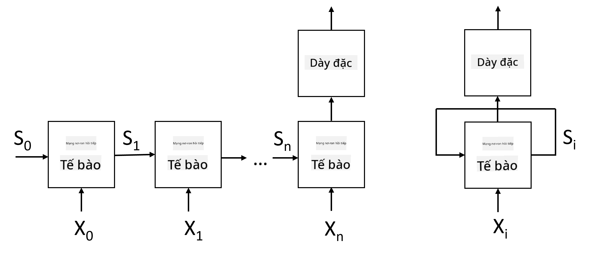
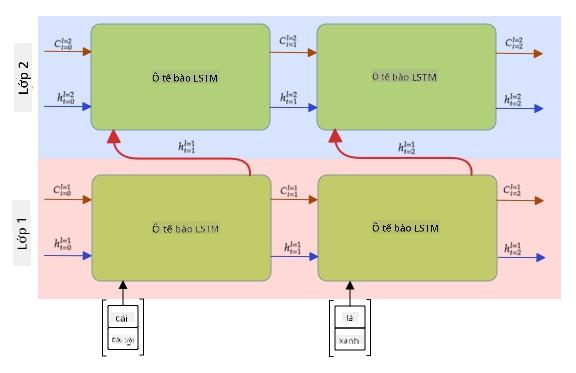

<!--
CO_OP_TRANSLATOR_METADATA:
{
  "original_hash": "58bf4adb210aab53e8f78c8082040e7c",
  "translation_date": "2025-08-29T12:47:30+00:00",
  "source_file": "lessons/5-NLP/16-RNN/README.md",
  "language_code": "vi"
}
-->
# Mạng Nơ-ron Hồi quy

## [Câu hỏi trước bài giảng](https://red-field-0a6ddfd03.1.azurestaticapps.net/quiz/116)

Trong các phần trước, chúng ta đã sử dụng các biểu diễn ngữ nghĩa phong phú của văn bản và một bộ phân loại tuyến tính đơn giản trên các embedding. Kiến trúc này giúp nắm bắt ý nghĩa tổng hợp của các từ trong một câu, nhưng nó không xem xét đến **thứ tự** của các từ, vì phép tổng hợp trên embedding đã loại bỏ thông tin này từ văn bản gốc. Do các mô hình này không thể mô hình hóa thứ tự từ, chúng không thể giải quyết các nhiệm vụ phức tạp hoặc mơ hồ hơn như tạo văn bản hoặc trả lời câu hỏi.

Để nắm bắt ý nghĩa của chuỗi văn bản, chúng ta cần sử dụng một kiến trúc mạng nơ-ron khác, được gọi là **mạng nơ-ron hồi quy**, hay RNN. Trong RNN, chúng ta đưa câu qua mạng từng ký hiệu một, và mạng sẽ tạo ra một **trạng thái**, sau đó chúng ta đưa trạng thái này vào mạng cùng với ký hiệu tiếp theo.

> Hình ảnh của tác giả

Với chuỗi đầu vào các token X0,...,Xn, RNN tạo ra một chuỗi các khối mạng nơ-ron và huấn luyện chuỗi này từ đầu đến cuối bằng cách sử dụng backpropagation. Mỗi khối mạng nhận một cặp (Xi,Si) làm đầu vào và tạo ra Si+1 làm kết quả. Trạng thái cuối cùng Sn hoặc (đầu ra Yn) được đưa vào một bộ phân loại tuyến tính để tạo ra kết quả. Tất cả các khối mạng đều chia sẻ cùng trọng số và được huấn luyện từ đầu đến cuối bằng một lần backpropagation.

Vì các vector trạng thái S0,...,Sn được truyền qua mạng, nó có thể học được các phụ thuộc tuần tự giữa các từ. Ví dụ, khi từ *không* xuất hiện ở đâu đó trong chuỗi, mạng có thể học cách phủ định một số phần tử trong vector trạng thái, dẫn đến phủ định.

> ✅ Vì các trọng số của tất cả các khối RNN trong hình trên được chia sẻ, hình ảnh này có thể được biểu diễn dưới dạng một khối (bên phải) với một vòng lặp hồi quy, truyền trạng thái đầu ra của mạng trở lại đầu vào.

## Cấu trúc của một tế bào RNN

Hãy xem cách một tế bào RNN đơn giản được tổ chức. Nó nhận trạng thái trước đó Si-1 và ký hiệu hiện tại Xi làm đầu vào, và phải tạo ra trạng thái đầu ra Si (và đôi khi, chúng ta cũng quan tâm đến một số đầu ra khác Yi, như trong trường hợp các mạng sinh).

Một tế bào RNN đơn giản có hai ma trận trọng số bên trong: một ma trận biến đổi ký hiệu đầu vào (gọi là W), và một ma trận biến đổi trạng thái đầu vào (H). Trong trường hợp này, đầu ra của mạng được tính là σ(W×Xi+H×Si-1+b), trong đó σ là hàm kích hoạt và b là độ chệch bổ sung.

> Hình ảnh của tác giả

Trong nhiều trường hợp, các token đầu vào được truyền qua lớp embedding trước khi vào RNN để giảm chiều dữ liệu. Trong trường hợp này, nếu kích thước của các vector đầu vào là *emb_size*, và vector trạng thái là *hid_size* - kích thước của W là *emb_size*×*hid_size*, và kích thước của H là *hid_size*×*hid_size*.

## Bộ nhớ dài ngắn hạn (LSTM)

Một trong những vấn đề chính của RNN cổ điển là vấn đề **gradient biến mất**. Vì RNN được huấn luyện từ đầu đến cuối trong một lần backpropagation, nó gặp khó khăn trong việc lan truyền lỗi đến các lớp đầu tiên của mạng, và do đó mạng không thể học được mối quan hệ giữa các token xa nhau. Một trong những cách để tránh vấn đề này là giới thiệu **quản lý trạng thái rõ ràng** bằng cách sử dụng các **cổng**. Có hai kiến trúc nổi tiếng thuộc loại này: **Bộ nhớ dài ngắn hạn** (LSTM) và **Đơn vị hồi tiếp có cổng** (GRU).

> Nguồn hình ảnh TBD

Mạng LSTM được tổ chức tương tự như RNN, nhưng có hai trạng thái được truyền từ lớp này sang lớp khác: trạng thái thực tế C và vector ẩn H. Tại mỗi đơn vị, vector ẩn Hi được nối với đầu vào Xi, và chúng kiểm soát những gì xảy ra với trạng thái C thông qua các **cổng**. Mỗi cổng là một mạng nơ-ron với hàm kích hoạt sigmoid (đầu ra trong khoảng [0,1]), có thể được coi như một mặt nạ bit khi nhân với vector trạng thái. Có các cổng sau (từ trái sang phải trong hình trên):

* **Cổng quên** nhận một vector ẩn và xác định các thành phần nào của vector C cần quên và các thành phần nào cần giữ lại.
* **Cổng đầu vào** lấy một số thông tin từ vector đầu vào và vector ẩn và chèn nó vào trạng thái.
* **Cổng đầu ra** biến đổi trạng thái qua một lớp tuyến tính với hàm kích hoạt *tanh*, sau đó chọn một số thành phần của nó bằng vector ẩn Hi để tạo ra trạng thái mới Ci+1.

Các thành phần của trạng thái C có thể được coi như các cờ có thể bật và tắt. Ví dụ, khi chúng ta gặp tên *Alice* trong chuỗi, chúng ta có thể giả định rằng nó đề cập đến một nhân vật nữ và bật cờ trong trạng thái rằng chúng ta có một danh từ nữ trong câu. Khi chúng ta gặp thêm cụm từ *và Tom*, chúng ta sẽ bật cờ rằng chúng ta có một danh từ số nhiều. Do đó, bằng cách thao tác trạng thái, chúng ta có thể theo dõi các thuộc tính ngữ pháp của các phần câu.

> ✅ Một tài liệu tuyệt vời để hiểu rõ hơn về nội dung bên trong của LSTM là bài viết [Understanding LSTM Networks](https://colah.github.io/posts/2015-08-Understanding-LSTMs/) của Christopher Olah.

## RNN hai chiều và nhiều lớp

Chúng ta đã thảo luận về các mạng hồi quy hoạt động theo một hướng, từ đầu chuỗi đến cuối chuỗi. Điều này có vẻ tự nhiên, vì nó giống cách chúng ta đọc và nghe lời nói. Tuy nhiên, vì trong nhiều trường hợp thực tế chúng ta có thể truy cập ngẫu nhiên vào chuỗi đầu vào, có thể hợp lý khi chạy tính toán hồi quy theo cả hai hướng. Các mạng như vậy được gọi là **RNN hai chiều**. Khi làm việc với mạng hai chiều, chúng ta sẽ cần hai vector trạng thái ẩn, một cho mỗi hướng.

Một mạng hồi quy, dù là một chiều hay hai chiều, nắm bắt các mẫu nhất định trong một chuỗi và có thể lưu trữ chúng vào một vector trạng thái hoặc truyền vào đầu ra. Tương tự như các mạng tích chập, chúng ta có thể xây dựng một lớp hồi quy khác trên lớp đầu tiên để nắm bắt các mẫu cấp cao hơn và xây dựng từ các mẫu cấp thấp được trích xuất bởi lớp đầu tiên. Điều này dẫn đến khái niệm về một **RNN nhiều lớp**, bao gồm hai hoặc nhiều mạng hồi quy, trong đó đầu ra của lớp trước được truyền vào lớp tiếp theo làm đầu vào.

*Hình ảnh từ [bài viết tuyệt vời này](https://towardsdatascience.com/from-a-lstm-cell-to-a-multilayer-lstm-network-with-pytorch-2899eb5696f3) của Fernando López*

## ✍️ Bài tập: Embedding

Tiếp tục học trong các notebook sau:

* [RNNs với PyTorch](RNNPyTorch.ipynb)
* [RNNs với TensorFlow](RNNTF.ipynb)

## Kết luận

Trong bài học này, chúng ta đã thấy rằng RNN có thể được sử dụng cho phân loại chuỗi, nhưng thực tế, chúng có thể xử lý nhiều nhiệm vụ khác, như tạo văn bản, dịch máy, và nhiều hơn nữa. Chúng ta sẽ xem xét các nhiệm vụ đó trong bài học tiếp theo.

## 🚀 Thử thách

Đọc qua một số tài liệu về LSTM và xem xét các ứng dụng của chúng:

- [Grid Long Short-Term Memory](https://arxiv.org/pdf/1507.01526v1.pdf)
- [Show, Attend and Tell: Neural Image Caption
Generation with Visual Attention](https://arxiv.org/pdf/1502.03044v2.pdf)

## [Câu hỏi sau bài giảng](https://red-field-0a6ddfd03.1.azurestaticapps.net/quiz/216)

## Ôn tập & Tự học

- [Understanding LSTM Networks](https://colah.github.io/posts/2015-08-Understanding-LSTMs/) của Christopher Olah.

## [Bài tập: Notebooks](assignment.md)

---

**Tuyên bố miễn trừ trách nhiệm**:  
Tài liệu này đã được dịch bằng dịch vụ dịch thuật AI [Co-op Translator](https://github.com/Azure/co-op-translator). Mặc dù chúng tôi cố gắng đảm bảo độ chính xác, xin lưu ý rằng các bản dịch tự động có thể chứa lỗi hoặc không chính xác. Tài liệu gốc bằng ngôn ngữ bản địa nên được coi là nguồn thông tin chính thức. Đối với các thông tin quan trọng, khuyến nghị sử dụng dịch vụ dịch thuật chuyên nghiệp bởi con người. Chúng tôi không chịu trách nhiệm cho bất kỳ sự hiểu lầm hoặc diễn giải sai nào phát sinh từ việc sử dụng bản dịch này.