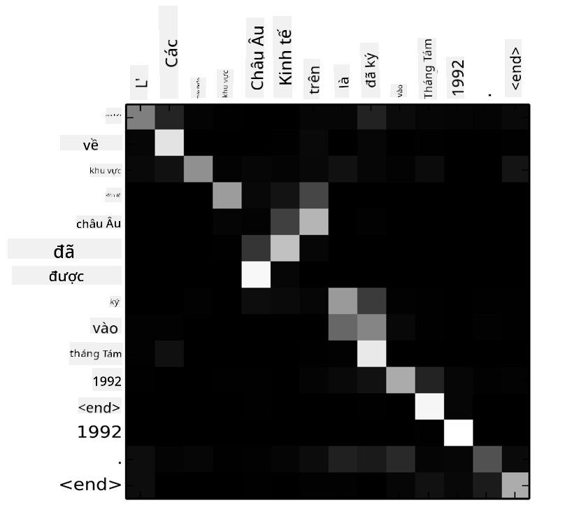
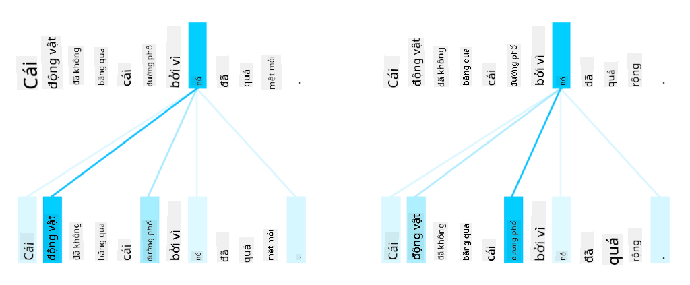
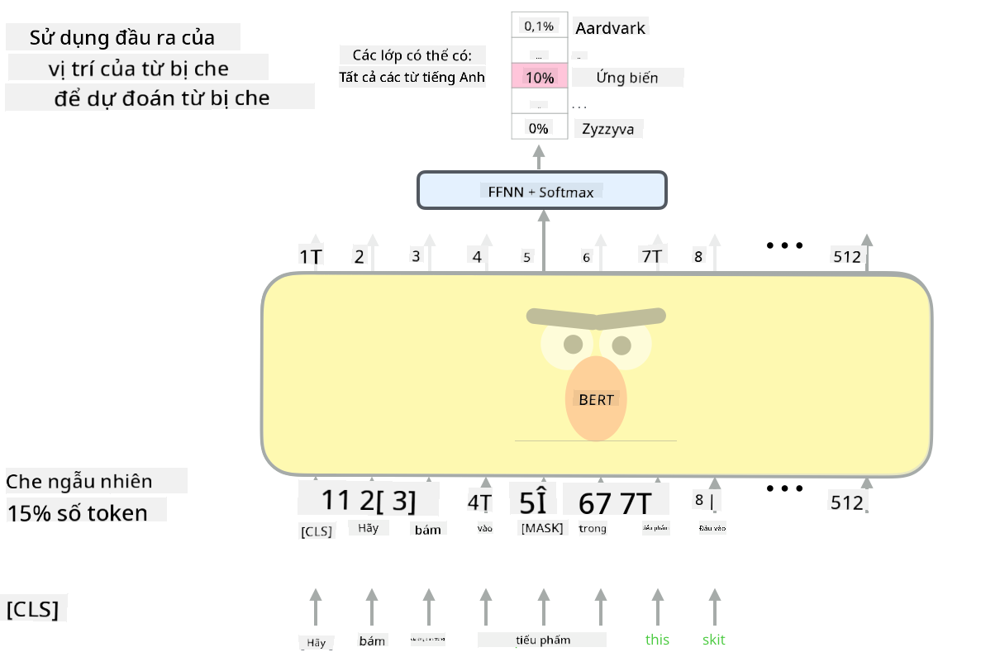

<!--
CO_OP_TRANSLATOR_METADATA:
{
  "original_hash": "7e617f0b8de85a43957a853aba09bfeb",
  "translation_date": "2025-08-29T12:43:42+00:00",
  "source_file": "lessons/5-NLP/18-Transformers/README.md",
  "language_code": "vi"
}
-->
# Cơ chế Attention và Transformers

## [Câu hỏi trước bài giảng](https://red-field-0a6ddfd03.1.azurestaticapps.net/quiz/118)

Một trong những vấn đề quan trọng nhất trong lĩnh vực NLP là **dịch máy**, một nhiệm vụ thiết yếu làm nền tảng cho các công cụ như Google Dịch. Trong phần này, chúng ta sẽ tập trung vào dịch máy, hoặc nói chung hơn, vào bất kỳ nhiệm vụ *chuỗi-đến-chuỗi* nào (còn được gọi là **chuyển đổi câu**).

Với RNNs, chuỗi-đến-chuỗi được triển khai bằng hai mạng hồi quy, trong đó một mạng, **encoder**, nén một chuỗi đầu vào thành trạng thái ẩn, trong khi mạng khác, **decoder**, giải mã trạng thái ẩn này thành kết quả đã dịch. Tuy nhiên, cách tiếp cận này gặp một số vấn đề:

* Trạng thái cuối cùng của mạng encoder gặp khó khăn trong việc ghi nhớ phần đầu của câu, dẫn đến chất lượng mô hình kém đối với các câu dài.
* Tất cả các từ trong một chuỗi đều có tác động như nhau đến kết quả. Tuy nhiên, trong thực tế, một số từ cụ thể trong chuỗi đầu vào thường có tác động lớn hơn đến đầu ra so với các từ khác.

**Cơ chế Attention** cung cấp một cách để gán trọng số cho tác động ngữ cảnh của từng vector đầu vào lên từng dự đoán đầu ra của RNN. Cách triển khai là tạo các đường tắt giữa các trạng thái trung gian của RNN đầu vào và RNN đầu ra. Theo cách này, khi tạo ra ký hiệu đầu ra yt, chúng ta sẽ xem xét tất cả các trạng thái ẩn đầu vào hi, với các hệ số trọng số khác nhau αt,i.

> Mô hình encoder-decoder với cơ chế attention cộng trong [Bahdanau et al., 2015](https://arxiv.org/pdf/1409.0473.pdf), trích từ [bài viết blog này](https://lilianweng.github.io/lil-log/2018/06/24/attention-attention.html)

Ma trận attention {αi,j} sẽ biểu diễn mức độ mà các từ đầu vào nhất định ảnh hưởng đến việc tạo ra một từ cụ thể trong chuỗi đầu ra. Dưới đây là một ví dụ về ma trận như vậy:

> Hình từ [Bahdanau et al., 2015](https://arxiv.org/pdf/1409.0473.pdf) (Hình 3)

Cơ chế attention chịu trách nhiệm cho phần lớn các thành tựu hiện tại hoặc gần đây trong NLP. Tuy nhiên, việc thêm attention làm tăng đáng kể số lượng tham số của mô hình, dẫn đến các vấn đề về khả năng mở rộng với RNNs. Một hạn chế chính của việc mở rộng RNNs là tính chất hồi quy của các mô hình khiến việc huấn luyện theo lô và song song trở nên khó khăn. Trong RNN, mỗi phần tử của một chuỗi cần được xử lý theo thứ tự tuần tự, điều này có nghĩa là không thể dễ dàng song song hóa.

> Hình từ [Blog của Google](https://research.googleblog.com/2016/09/a-neural-network-for-machine.html)

Việc áp dụng cơ chế attention kết hợp với hạn chế này đã dẫn đến sự ra đời của các mô hình Transformer hiện đại mà chúng ta biết và sử dụng ngày nay như BERT và Open-GPT3.

## Mô hình Transformer

Một trong những ý tưởng chính đằng sau transformers là tránh tính chất tuần tự của RNNs và tạo ra một mô hình có thể song song hóa trong quá trình huấn luyện. Điều này đạt được bằng cách triển khai hai ý tưởng:

* mã hóa vị trí
* sử dụng cơ chế self-attention để nắm bắt các mẫu thay vì RNNs (hoặc CNNs) (đó là lý do tại sao bài báo giới thiệu transformers có tên là *[Attention is all you need](https://arxiv.org/abs/1706.03762)*)

### Mã hóa/nhúng vị trí

Ý tưởng của mã hóa vị trí như sau:  
1. Khi sử dụng RNNs, vị trí tương đối của các token được biểu diễn bằng số bước, do đó không cần phải biểu diễn rõ ràng.  
2. Tuy nhiên, khi chuyển sang attention, chúng ta cần biết vị trí tương đối của các token trong một chuỗi.  
3. Để có mã hóa vị trí, chúng ta bổ sung chuỗi các token bằng một chuỗi các vị trí token trong chuỗi (tức là, một chuỗi số 0, 1, ...).  
4. Sau đó, chúng ta trộn vị trí token với vector nhúng token. Để chuyển đổi vị trí (số nguyên) thành vector, chúng ta có thể sử dụng các cách tiếp cận khác nhau:

* Nhúng có thể huấn luyện, tương tự như nhúng token. Đây là cách tiếp cận được xem xét ở đây. Chúng ta áp dụng các lớp nhúng lên cả token và vị trí của chúng, tạo ra các vector nhúng có cùng kích thước, sau đó cộng chúng lại với nhau.
* Hàm mã hóa vị trí cố định, như được đề xuất trong bài báo gốc.

> Hình ảnh của tác giả

Kết quả mà chúng ta nhận được với nhúng vị trí là nhúng cả token gốc và vị trí của nó trong chuỗi.

### Self-Attention Đa Đầu

Tiếp theo, chúng ta cần nắm bắt một số mẫu trong chuỗi của mình. Để làm điều này, transformers sử dụng cơ chế **self-attention**, về cơ bản là attention được áp dụng cho cùng một chuỗi làm đầu vào và đầu ra. Việc áp dụng self-attention cho phép chúng ta xem xét **ngữ cảnh** trong câu và xem các từ nào có liên quan đến nhau. Ví dụ, nó cho phép chúng ta thấy các từ nào được tham chiếu bởi các đại từ, như *nó*, và cũng xem xét ngữ cảnh:

> Hình ảnh từ [Blog của Google](https://research.googleblog.com/2017/08/transformer-novel-neural-network.html)

Trong transformers, chúng ta sử dụng **Self-Attention Đa Đầu** để cung cấp cho mạng khả năng nắm bắt nhiều loại phụ thuộc khác nhau, ví dụ: mối quan hệ từ dài hạn so với ngắn hạn, đồng tham chiếu so với thứ khác, v.v.

[Notebook TensorFlow](TransformersTF.ipynb) chứa thêm chi tiết về việc triển khai các lớp transformer.

### Attention Encoder-Decoder

Trong transformers, attention được sử dụng ở hai nơi:

* Để nắm bắt các mẫu trong văn bản đầu vào bằng self-attention
* Để thực hiện dịch chuỗi - đó là lớp attention giữa encoder và decoder.

Attention encoder-decoder rất giống với cơ chế attention được sử dụng trong RNNs, như đã mô tả ở đầu phần này. Biểu đồ động này giải thích vai trò của attention encoder-decoder.

Vì mỗi vị trí đầu vào được ánh xạ độc lập đến mỗi vị trí đầu ra, transformers có thể song song hóa tốt hơn RNNs, điều này cho phép các mô hình ngôn ngữ lớn hơn và biểu đạt hơn. Mỗi đầu attention có thể được sử dụng để học các mối quan hệ khác nhau giữa các từ, cải thiện các nhiệm vụ Xử lý Ngôn ngữ Tự nhiên.

## BERT

**BERT** (Bidirectional Encoder Representations from Transformers) là một mạng transformer nhiều lớp rất lớn với 12 lớp cho *BERT-base*, và 24 lớp cho *BERT-large*. Mô hình này được huấn luyện trước trên một tập dữ liệu văn bản lớn (WikiPedia + sách) bằng cách huấn luyện không giám sát (dự đoán các từ bị che trong câu). Trong quá trình huấn luyện trước, mô hình hấp thụ mức độ hiểu biết ngôn ngữ đáng kể, sau đó có thể được tận dụng với các tập dữ liệu khác bằng cách tinh chỉnh. Quá trình này được gọi là **học chuyển giao**.

> Hình ảnh [nguồn](http://jalammar.github.io/illustrated-bert/)

## ✍️ Bài tập: Transformers

Tiếp tục học trong các notebook sau:

* [Transformers trong PyTorch](TransformersPyTorch.ipynb)
* [Transformers trong TensorFlow](TransformersTF.ipynb)

## Kết luận

Trong bài học này, bạn đã tìm hiểu về Transformers và Cơ chế Attention, tất cả đều là công cụ thiết yếu trong bộ công cụ NLP. Có nhiều biến thể của kiến trúc Transformer bao gồm BERT, DistilBERT, BigBird, OpenGPT3 và nhiều hơn nữa có thể được tinh chỉnh. Gói [HuggingFace](https://github.com/huggingface/) cung cấp kho lưu trữ để huấn luyện nhiều kiến trúc này với cả PyTorch và TensorFlow.

## 🚀 Thử thách

## [Câu hỏi sau bài giảng](https://red-field-0a6ddfd03.1.azurestaticapps.net/quiz/218)

## Ôn tập & Tự học

* [Bài viết blog](https://mchromiak.github.io/articles/2017/Sep/12/Transformer-Attention-is-all-you-need/), giải thích bài báo kinh điển [Attention is all you need](https://arxiv.org/abs/1706.03762) về transformers.
* [Một loạt bài viết blog](https://towardsdatascience.com/transformers-explained-visually-part-1-overview-of-functionality-95a6dd460452) về transformers, giải thích chi tiết kiến trúc.

## [Bài tập](assignment.md)

---

**Tuyên bố miễn trừ trách nhiệm**:  
Tài liệu này đã được dịch bằng dịch vụ dịch thuật AI [Co-op Translator](https://github.com/Azure/co-op-translator). Mặc dù chúng tôi cố gắng đảm bảo độ chính xác, xin lưu ý rằng các bản dịch tự động có thể chứa lỗi hoặc không chính xác. Tài liệu gốc bằng ngôn ngữ bản địa nên được coi là nguồn thông tin chính thức. Đối với các thông tin quan trọng, nên sử dụng dịch vụ dịch thuật chuyên nghiệp bởi con người. Chúng tôi không chịu trách nhiệm cho bất kỳ sự hiểu lầm hoặc diễn giải sai nào phát sinh từ việc sử dụng bản dịch này.